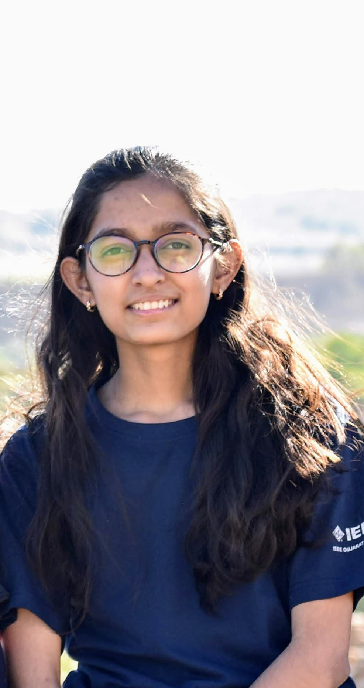

<table style="width:100%;max-width:800px;border:0px;border-spacing:0px;border-collapse:separate;margin-right:auto;margin-left:auto;">
<tr style="padding:0px">
<td style="padding:0px">
<table style="width:100%;border:0px;border-spacing:0px;border-collapse:separate;margin-right:auto;margin-left:auto;">
<tr style="padding:0px">
<td style="padding:2.5%;width:60%;vertical-align:middle">
<h1>
  Hena Ghonia
</h1>

I am Master's student at University of Montreal and MILA. I am interested in building systems that generalize well like humans do and are interpretable.
 
 
Previously, I worked at Ecolab as part of Advanced data analytics team. I worked on projects requiring proof of concept using predictive analytics such as Pump efficiency prediction, Analysing paint defects for automotive customers and Wearable analytics.
 
 
I have Bachelor of Technology in Information and Communication Technology from Ahmedabad University.

<!-- 
 -->
<!-- Before. -->
<!-- 
 -->

  <a href="mailto:henaghonia2015@gmail.com">Email</a> &nbsp/&nbsp
  <a href="https://github.com/Hstellar">GitHub</a> &nbsp;/&nbsp
  <!-- <a href="https://scholar.google.com/citations?user=0IWgVz4AAAAJ">Google Scholar</a> &nbsp;/&nbsp; -->
  <a href="https://www.linkedin.com/in/hena-ghonia-0876aa129/"> LinkedIn </a>

</td>
<td style="padding:2.5%;width:20%;max-width:40%">

</td>
</tr>
</table>

<h2>Presentation </h2>

<h3>Predicting Diabetes Mellitus in ICU Patients</h3>

We developed a predictive machine learning model and explore a methods to interpret the results to improve our understanding of  medical data. 
Author: Hena Ghonia, Shanaya Mehta | Date: 2021-09-19 |
  Venue: "Pycon India 2021" | <a href="/pdfs/Poster_PyconIndia_2021.pdf">Poster</a>    

<h3>Hyperparameter tuning using Dask</h3>
  

    I presented methods of adaptive hyperparameter search using Dask library. 
   Date: 2021-09-19 | Venue: "WIDS mysuru 2020" |   <a href="https://github.com/Hstellar/wids_mysuru_2020">Code</a> | <a href="https://www.youtube.com/watch?v=eE30Z2ZfTic&t=10089s">Video</a>
  

<h2>Data Science Competition </h2>
<h3>Covid19 Immunology app-a-thon</h3>

To explore the relationship between personalized immune repertoires and COVID-19 disease variables and associated factors. 
  Hosted by: PrecisionFDA |Team name: Clique Precision | <a href="https://share.streamlit.io/hstellar/covid_immunology_appathon_streamlit/main/appathon.py">Exploration Results</a>|<a href="https://github.com/Interestship2-0/COVID19-Immunology-App-a-thon">Code</a>  
We received silver badge in impact category.   

<h3>COVID-19 Risk Factor Modeling Challenge </h3>

 Developed machine learning models to predict COVID-19 related health outcomes, including COVID-19 status, length of hospitalization, and mortality, using synthetic Veteran health records 
  Hosted by: PrecisionFDA |

